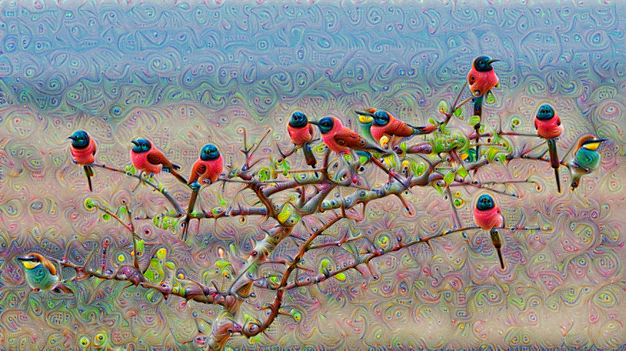

# Deep Dream

见我的 [博客](http://keke046.github.io/2021/12/26/deep-dream/)。

设$x$为输入图像，$\delta$为加入的扰动，$G_L$为网络第$L$层输出，带 $\lambda$ 的是惩罚项，其中$c$表示通道。优化目标为：
$$
\delta = \argmax_\delta \quad ||G_L(x + \delta)||_2^2 - \lambda \sum_{c,i,j} |x_{c,i,j} - \overline{x}_c| \cdot |\delta_{c,i,j}|
$$

效果：

